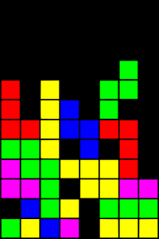
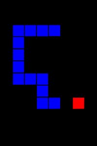
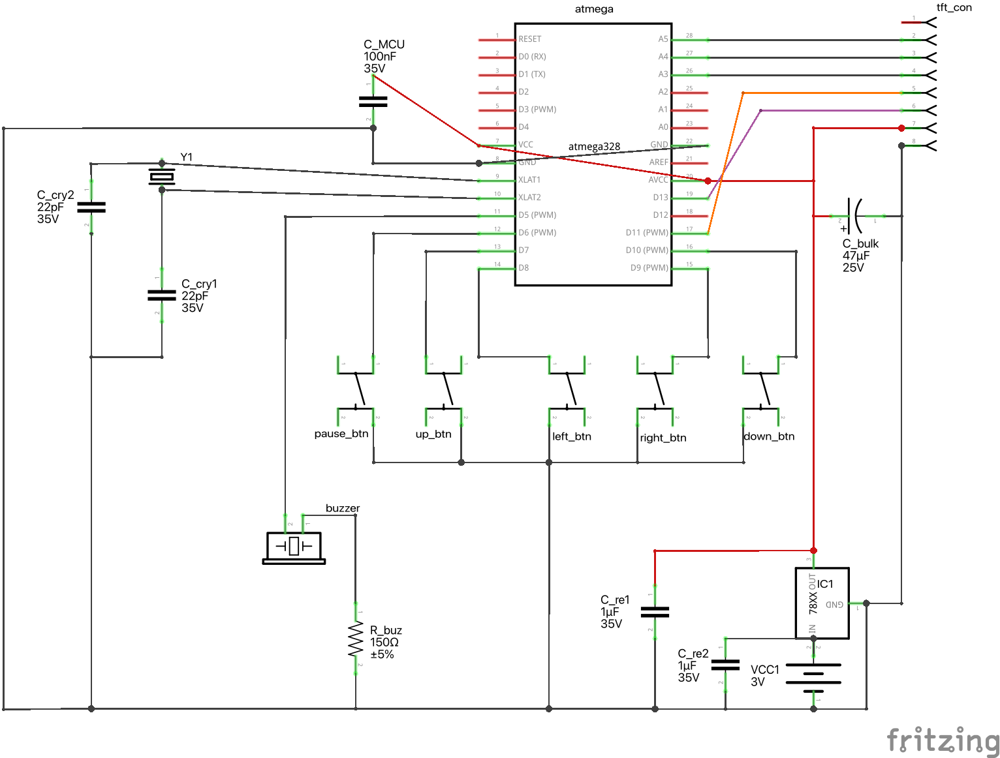

# arduino-tetris

A simple Tetris + Snakes DIY project.

 &nbsp;&nbsp;&nbsp;&nbsp;&nbsp;&nbsp; 

## Software

This project should run with the Ardiono IDE, make sure the following libraries are installed:

```c++
#include <Adafruit_GFX.h>
#include <Adafruit_ST7735.h>
#include <SPI.h>
```

### Class Hierarchy Overview

### Entity Hierarchy

- **Entity** (abstract base)
  - **LiveEntity** - Entities with position and color
    - **Shape** - Individual Tetris piece
    - **Snake** - Player-controlled snake
  - **Blob** - Grid-based entities
    - **TetrisBlob** - Tetris game board
    - **Body** - Snake's body segments

### Game Hierarchy

- **Game** (abstract base)
  - **Tetris** - Tetris implementation
  - **Snakes** - Snake game implementation

### Utility Classes

- **Screen** - All rendering operations (static)
- **Sound** - All audio operations (static)

## Key Relationships

1. **Tetris Game** manages:
   - Multiple `Shape` instances (current falling piece)
   - `TetrisBlob` (the game board)

2. **Snakes Game** manages:
   - `Snake` instance (player's snake)
   - `Body` through Snake (snake's segments)

3. **Screen & Sound** provide static utility methods used throughout the game

4. **Input & Events** define the communication protocol between games and the main loop

## Hardware

### Schematic

### For breadboard

- Arduino board or compatible
- 5 push buttons
- A passive piezzo buzzer
- A TFT LDC 128x160 screen. If the screen is 3.3v and your board is 5v, you will need to use the 3.3v power pin (if available), and put a resitor (~2k ohm) in all pins connecting the board to the screen. (you can choose something else, but you will have to alter the `screens.cpp` file).

### For a full standalone AtMega project



- 5 push buttons
- 1 slide switch
- 1 1.8" TFT LCD screen
- 1 MCO1700 voltage regulator
- 1 ATMega328P
- 1 8MHz crystal oscilator
- 2 1uF ceramic capacitors
- 2 22pF ceramic capacitors
- 1 100nF ceramic capacitor
- 1 33uF electrolytic capacitor
- 1 150ohm resistor
- 1 10k resistor
- 1 28-pin IC socket
- 22 AWG solid core wire
- 1 3 AA Battery holder
- 1 7x9 cm double-sided perfboard
